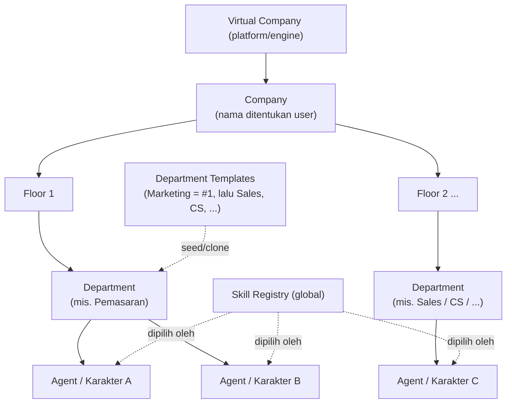
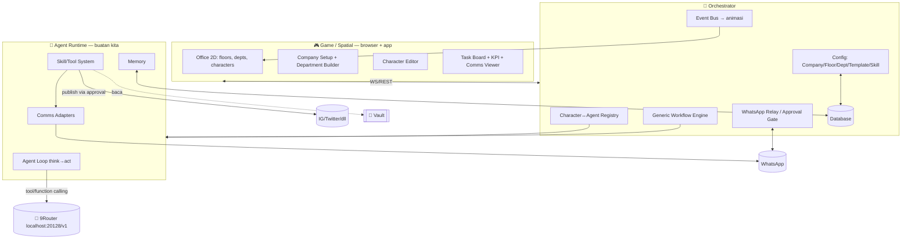
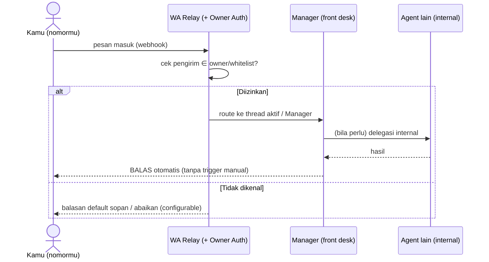

# Virtual Company — Platform Planning & Roadmap (Canonical)

> **Pergeseran kunci:** ini **bukan** sekadar "marketing company" — ini **platform Virtual Company** yang generik. Di dalamnya kamu membuat perusahaan, **menamainya sendiri**, lalu menentukan **lantai / departemen / agent**-nya. **Marketing = departemen/template pertama** untuk membuktikan platform jalan end-to-end; departemen lain (Sales, CS, Produk, Finance, HR, dst) menyusul lewat sistem template.
> Tetap: dunia 2D ala **Stardew Valley**; tiap karakter = **agent (runtime buatan kita, referensi: OpenClaw)**; otak/LLM lewat **9Router** (`localhost:20128/v1`); instruksi & approval lewat **WhatsApp**.
> Untuk dieksekusi **Claude Code** & **Codex**. Prosa Bahasa Indonesia; identifier/file/data model English.
> Status: **CANONICAL v1** — menggantikan `virtual-company-plan.md`, `marketing-agent-company-plan.md`, dan `…-v3.md`.

---

## 0. Ringkasan Eksekutif

**Produk:** sebuah platform untuk membangun **perusahaan virtual** berisi agent AI yang benar-benar bekerja, divisualkan sebagai kantor 2D ala Stardew Valley. Pengguna:
- membuat **Company** (kasih nama bebas, mis. *"PT Maju Jaya"*),
- menyusun **Floor** (lantai) & **Department** (departemen),
- membuat/mengedit **karakter (agent)** dengan deskripsi *"dia siapa & kerja apa"*,
- memberi arahan via **WhatsApp**, dan agent **lapor & minta approval via WhatsApp** sebelum aksi berisiko.

**Engine bersifat generik & data-driven** — tidak ada yang di-hardcode ke "marketing". Marketing hanyalah **Department Template #1** yang dipakai untuk memvalidasi seluruh alur.

**Lima lapisan:**
1. **Game/Spatial layer** — kantor 2D (browser + app); sekaligus control panel (Company Setup, Character Editor, Task Board, KPI/HUD, Comms Viewer).
2. **Agent Runtime (buatan kita)** — agent loop (think→act), memory, sistem skill/tool, kontrol browser, comms.
3. **Orchestrator** — registry karakter↔agent, **workflow engine generik** (pipeline didefinisikan per-departemen), WA relay, approval gate, event bus.
4. **Configuration layer** — Company / Floor / Department / Department Templates / Skill Registry (semua data-driven).
5. **9Router (dipakai langsung)** — gateway LLM tunggal; fallback 3-tier + hemat token; pusat kontrol biaya.

---

## 1. Model Konsep (generik)



Inti:
- **Company** dibuat & dinamai pengguna; terdiri dari **Floor**; tiap Floor memuat satu/lebih **Department**; tiap Department berisi **Agent** (karakter).
- **Department Template** = paket siap pakai (kumpulan role + skill default + workflow default). Mulai dari template atau buat custom. **Marketing = template pertama**.
- **Skill Registry** global; departemen/agent memilih skill yang relevan ("bebas dalam lingkup kerja" = `skillScope` + `guardrails`).
- **Workflow engine generik** menjalankan pipeline yang didefinisikan per-departemen (Marketing punya pipeline-nya sendiri, departemen lain punya pipeline berbeda).

---

## 2. Arsitektur



**Alur:** arahan via WA → Manager departemen → Workflow Engine men-dispatch task ke agent → tiap agent jalankan agent loop (mikir via 9Router, panggil skill) → karakter beranimasi → validasi (review) → **Approval Gate** via WA → eksekusi (mis. publish) → audit log + Task Board.

---

## 3. Agent Runtime (komponen inti buatan kita; referensi OpenClaw)

### 3.1 Agent loop (pseudocode)
```
loop(agent, event):
  ctx = buildContext(persona=agent.description, guardrails, memory=retrieve(agent,event),
                     tools=toolsFor(agent.skillScope))
  while not done and steps < maxSteps:
    resp = router.chat(ctx, tools)               # 9Router, OpenAI-compatible
    if resp.tool_calls:
      for call in resp.tool_calls:
        if isRisky(call) and not approved(call): requestApproval(call); pause
        else: ctx.append(executeSkill(call))
    else: done = true
  saveMemory(agent, ctx); emitEvents(agent)       # → animasi & status task
```

### 3.2 Skill interface (TS)
```ts
interface SkillContext {
  agentId: string; router: RouterClient; vault: VaultReader;
  emit: (e: AgentEvent) => void;
  requestApproval: (req: ApprovalDraft) => Promise<ApprovalRequest>;
}
interface Skill<I=unknown, O=unknown> {
  name: string; description: string;        // dipakai LLM utk memilih tool
  paramsSchema: JsonSchema; risky?: boolean; // risky → wajib approval
  handler: (input: I, ctx: SkillContext) => Promise<O>;
}
```
> Skill bersifat **global & generik**. Departemen apa pun memilih dari **Skill Registry**. Menambah skill = menambah file di `skills/`, bukan mengubah loop.

### 3.3 Memory, comms, multi-agent
- **Memory**: short-term (percakapan) + long-term (`MemoryItem`, retrieval recency+relevance; keyword dulu, embeddings via 9Router nanti), namespace per-agent.
- **Comms**: `ChannelAdapter` (`WhatsAppAdapter`, `InternalBusAdapter`). WhatsApp: utamakan **Cloud API resmi**; library web (mis. Baileys) untuk proto.
- **Multi-agent**: registry + routing; delegasi via skill `message_agent` (Manager → anggota departemen).

---

## 4. Configuration Layer (yang bikin platform "generik")

- **Company Setup** (UI): buat company, kasih nama & branding, tambah floor.
- **Department Builder** (UI): tambah departemen ke floor — pilih dari **Department Template** atau buat custom; atur tujuan, skill pool, dan pipeline (workflow).
- **Department Template**: paket role + skill default + workflow default. **Library template** bertumbuh: Marketing (#1), lalu Sales, Customer Support, Product/R&D, Finance, HR, Ops, dst.
- **Skill Registry**: katalog global skill; departemen/agent memilih subset.
- **Workflow generik**: `WorkflowDef` (langkah, peran pelaksana, gate approval, loop revisi) — engine menjalankan apa pun yang didefinisikan, jadi tiap departemen bisa beda alur.

---

## 5. Departemen Pertama — Marketing (Template #1, untuk validasi)

Dipakai membuktikan seluruh platform berjalan. **Semua editable** (ini cuma seed).

| Role | Tugas | Skill scope |
|---|---|---|
| **Manager** | terima arahan, pecah task, koordinasi, lapor & minta approval | `message_agent`, `ask_user` |
| **Market Checker** | riset tren/kompetitor/audiens/keyword | `web_search`, `web_fetch`, `browser_do`, `market_research` |
| **Script Maker** | tulis konten (caption, script video, thread, hook, CTA) | `write_content` |
| **Reviewer** | review kualitas, brand voice, kepatuhan | `review_content` |
| **Social Media** | jadwalkan & publish (setelah approve) | `ig_post`, `twitter_post`, `schedule_post` |
| *(opsional)* Designer / Analyst | brief visual / metrik | image-gen via 9Router / analytics |

**Workflow Marketing:** Manager → Market Checker → Script Maker → Reviewer (loop revisi) → **Approval via WA** → Social Media publish → konfirmasi via WA. (Sequence diagram sama seperti rancangan sebelumnya; publish ke akun asli **selalu** approval-gated — lihat §8.)

> Departemen lain nanti = **template lain** dengan role/skill/workflow berbeda, tapi engine, runtime, comms, dan approval **sama**.

---

## 6. Karakter Editable
Character Editor mengisi: identitas (nama, sprite, departemen, posisi meja), peran, **deskripsi → system prompt/persona**, **skill scope**, **guardrails**, comms handle, model policy (tier/provider via 9Router). Form → **AgentProfile** (§9). Buat karakter = daftarkan agent baru di departemen; edit = update & reload.

---

## 7. WhatsApp — Pintu Utama Percakapan (auto-reply)

WhatsApp adalah **interface utama** kamu ↔ perusahaan: kamu chat, **agent otomatis menjawab**, percakapan berlanjut natural (bukan sekadar terima task).

### 7.1 Provisioning
- Kamu menyediakan **satu nomor telpon + akun WA** untuk perusahaan (nomor "front desk" perusahaan).
- **Cloud API resmi**: daftarkan nomor sebagai WhatsApp Business number + pasang webhook inbound. **Baileys (proto)**: scan QR pakai nomor tsb.
- Sistem menyimpan mapping: `nomor perusahaan ↔ Company`, dan **nomor pemilik (kamu) = owner**.

### 7.2 Auto-reply loop

- **Satu nomor, Manager sebagai wajah** (default): semua balasan keluar dari Manager agar percakapan koheren — agent lain dipanggil **internal** (lihat skill `message_agent`), tidak ikut "ngomong" langsung ke kamu. (Alternatif "handle per agent" = open decision §13.)
- **Threading**: tiap topik/directive = satu thread; balasanmu (mis. menjawab pertanyaan klarifikasi) nyambung ke konteks thread itu.
- **Approval inline**: permintaan approval muncul sebagai pesan dalam thread; balas `APPROVE` / `REVISI: ...` untuk lanjut.

### 7.3 Keamanan akses (penting)
- **Owner Auth**: hanya **nomor terdaftar (owner / whitelist)** yang boleh memberi arahan & approval. Nomor lain tidak bisa menyetir agent — kalau tidak, siapa pun yang chat ke nomor perusahaan bisa mengendalikannya.
- **Auto-reply ≠ auto-action**: menjawab/ngobrol otomatis; tapi **aksi eksternal** (publish, DM massal, transaksi) tetap **approval-gated** (§8).

### 7.4 Sosial
- Utamakan **API resmi** (X API, Instagram Graph API); browser (Playwright) fallback. Kredensial di **Vault**; semua publish approval-gated + preview.

---

## 8. Keamanan, Approval, Biaya (WAJIB, lintas departemen)
- **Approval Gates**: aksi berisiko (publish, DM massal, transaksi, ubah setting) **selalu** butuh approval via WA; default semua agent **propose, don't execute**.
- **Credential Vault** terenkripsi (keychain/sops/age); **audit log** tiap aksi + approval. Jangan commit/taruh secret di prompt.
- **Biaya via 9Router**: routing tier per-peran, throttle, cache; jangan panggil LLM tiap tick animasi.
- **Least privilege**: batasi direktori/perintah/domain; sandbox bila bisa.

---

## 9. Data Models (TS — `packages/shared`)
```ts
type Id = string; type Vec2 = { x:number; y:number };

interface Company { id:Id; name:string; branding?:Record<string,unknown>; createdAt:number; floorIds:Id[]; }
interface Floor { id:Id; companyId:Id; name:string; index:number; mapKey:string; departmentIds:Id[]; }
interface Department {
  id:Id; companyId:Id; floorId:Id; name:string;
  templateId?:Id; purpose:string; skillPool:string[]; workflowId?:Id; agentIds:Id[];
}
interface DepartmentTemplate {
  id:Id; name:string; description:string;
  roleTemplates:RoleTemplate[]; defaultSkills:string[]; defaultWorkflow:WorkflowDef;
}
interface RoleTemplate { role:string; description:string; skillScope:string[]; guardrails:Guardrail[]; spriteKey?:string; }

interface AgentProfile {            // = karakter
  id:Id; departmentId:Id; name:string; role:string;
  deskPos:Vec2; spriteKey:string;
  description:string;               // → system prompt
  skillScope:string[]; guardrails:Guardrail[];
  commsHandle?:string;
  modelPolicy?:{ tier?:"subscription"|"cheap"|"free"; preferredProvider?:string };
  memoryNamespace:string;
  status:"idle"|"working"|"talking"|"blocked";
}
interface Guardrail { rule:string; params?:Record<string,unknown>; }

interface WorkflowDef { id:Id; name:string; steps:WorkflowStep[]; }
interface WorkflowStep {
  id:Id; role:string; action:string;            // skill/intent
  next?: Id | "approval_gate" | "loop_until_pass";
}

interface MemoryItem { id:Id; agentId:Id; kind:"observation"|"decision"|"result"; text:string; createdAt:number; importance:number; tags:string[]; embedding?:number[]; }
interface Directive { id:Id; text:string; source:"whatsapp"|"ui"; createdAt:number; status:"received"|"planned"|"in_progress"|"awaiting_approval"|"done"; }
type TaskStatus = "todo"|"in_progress"|"blocked"|"review"|"awaiting_approval"|"done";
interface Task { id:Id; directiveId:Id; departmentId:Id; title:string; assignee:Id; status:TaskStatus; inputs?:Record<string,unknown>; outputRef?:Id; dependsOn:Id[]; }
interface Artifact { id:Id; kind:string; taskId:Id; content:string; meta?:Record<string,unknown>; }
interface ApprovalRequest { id:Id; summary:string; artifactId:Id; channel:"whatsapp"; status:"pending"|"approved"|"rejected"; decidedAt?:number; note?:string; }
interface CommsMessage { id:Id; threadId:Id; from:"user"|Id; to:"user"|Id; channel:"whatsapp"|"internal"; text:string; at:number; }
interface AuditEntry { id:Id; agentId:Id; action:string; approvalId?:Id; at:number; detail:Record<string,unknown>; }
```

---

## 10. Tech Stack & Struktur Folder

| Area | Pilihan |
|---|---|
| Game/render | Phaser 3 + TS + Vite |
| UI panel | React (Company Setup, Dept Builder, Character Editor, Task Board) |
| Map | Tiled (JSON) · pathfinding easystarjs |
| Orchestrator | Node.js + TS (Fastify) · WebSocket (socket.io) |
| **Agent Runtime** | TS (kode kita): loop + skills + memory + comms |
| Browser skill | Playwright |
| Brain/LLM | **9Router** `localhost:20128/v1` |
| DB | SQLite → Postgres |
| Secrets | Vault (keychain/sops/age) |
| WhatsApp | Cloud API resmi / Baileys (proto) |
| Desktop app | Tauri |

```
virtual-company/
├─ apps/
│  ├─ web/        # Phaser 3 + React: scenes/ ui/ entities/ net/ ; public/assets/
│  ├─ server/     # Orchestrator: registry/ workflow/ config/ comms/ security/
│  └─ desktop/    # Tauri shell (fase 6)
├─ packages/
│  ├─ agent-runtime/   # ⭐ loop.ts skills/ memory/ comms/ router/ guardrails/
│  ├─ templates/       # ⭐ department templates (marketing, lalu sales, cs, ...)
│  └─ shared/          # tipe & kontrak event
├─ infra/scripts/      # start 9Router, start agents, seed company+marketing
└─ docs/  SPIKES.md  RUNBOOK.md
```

---

## 11. Roadmap (Phase 0 → 6, dengan Definition of Done)

> Strategi: **engine dibangun generik sejak awal**, lalu **Marketing dipakai sebagai vertikal pertama** untuk membuktikan seluruh alur (Phase 0–4). Setelah terbukti, **digeneralisasi jadi platform** (Phase 5). Spike integrasi berisiko dulu. Kontrak di `packages/shared` lebih dulu. Satu DoD per PR.

### Phase 0 — Foundations & Spikes 🔬
- **9Router**: endpoint + **tool/function calling** OpenAI-compatible jalan (chat + fallback).
- **Agent loop minimal**: 1 agent, pesan → LLM via 9Router → 1 skill (`web_search`) → balas; memory tersimpan.
- **WhatsApp adapter**: provisioning 1 nomor (Cloud API vs Baileys) + webhook inbound + **owner auth** (filter nomor pengirih) + kirim/terima.
- **DoD:** `docs/SPIKES.md` terisi; skrip bisa start 9Router + jalankan 1 agent loop pakai 1 tool nyata + **chat dari nomormu → agent auto-reply** lewat nomor perusahaan; pesan dari nomor lain ditolak. Kontrak skill/router final.

### Phase 1 — Platform Shell + Company Setup 🎮
- Tilemap kantor (lantai); karakter berjalan; jam + HUD.
- **Company Setup** (buat & namai company, tambah floor) + **Department Builder** + **Character Editor** (AgentProfile → DB).
- **Seed Marketing template** sebagai departemen pertama. Task Board & Comms Viewer (dummy).
- **DoD:** buat company bernama bebas → tambah departemen Marketing dari template → karakter muncul di lantai & bisa berjalan; semua config tersimpan & ter-load ulang.

### Phase 2 — Runtime + 1 Agent Nyata 🤖
- Integrasikan `agent-runtime` dengan orchestrator; **1 karakter = 1 agent hidup**.
- Directive (UI/WA) → agent kerjakan task nyata (tulis konten) → **Artifact** + animasi "working".
- **DoD:** ketik arahan → karakter "bekerja" → konten asli AI (via 9Router) tersimpan & tampil di Task Board.

### Phase 3 — Departemen Lengkap + Workflow Engine 🧩
- Semua role Marketing sebagai agent; **workflow engine generik** menjalankan pipeline departemen (Manager→research→write→review loop) + delegasi `message_agent`.
- **WA relay** 2 arah + **Approval Gate** sebelum publish; threading rapi.
- **DoD:** 1 directive mengalir lewat seluruh departemen → konten direview & dicek pasar → Manager minta approval via WA; keputusanmu menggerakkan langkah berikut.

### Phase 4 — Aksi Eksternal + Keamanan 🔐
- Skill `ig_post`/`twitter_post` (API resmi diutamakan; browser fallback) + **Vault** + **audit log**; semua approval-gated + guardrails (rate limit, jam posting).
- **DoD:** konten yang di-approve **terbit di akun test**, dengan audit trail & approval manual.

### Phase 5 — Platform Generalization 🏢⭐
- **Department Template Library**: tambah departemen lain (Sales, CS, Produk, Finance, HR, …) dari template **atau** custom lewat Department Builder; multi-floor & perpindahan lantai.
- KPI dashboard per departemen/company; save/resume; optimasi performa & biaya.
- **DoD:** pengguna bisa membuat company baru, menambah **≥2 departemen berbeda** (mis. Marketing + satu lainnya) dari template/custom, dan keduanya berjalan stabil; biaya per "hari kerja" terpantau.

### Phase 6 — App Packaging 📦
- **Tauri** desktop (bungkus web + menjalankan/memantau 9Router & agent lokal); web responsif; opsional mobile companion.
- **DoD:** dobel-klik app → service lokal hidup → platform jalan; juga jalan di browser.

---

## 12. Risiko & Mitigasi
| Risiko | Dampak | Mitigasi |
|---|---|---|
| Bangun runtime sendiri = scope besar | Tinggi | Mulai minimal (loop+1 skill); pola tool-calling standar (matang); tambah skill bertahap |
| Generik terlalu dini → over-engineering | Sedang | **Buktikan Marketing dulu (P0–P4)**, baru generalisasi (P5) |
| WhatsApp resmi butuh setup; unofficial rawan blokir | Sedang | Cloud API utk produksi; Baileys utk proto; isolasi di `comms` |
| Otomasi IG/Twitter langgar ToS | Tinggi | API resmi; approval-gate; rate limit; akun test |
| Runtime akses sistem/browser luas | Tinggi | Least-privilege, sandbox, batasi domain/perintah, Vault |
| Biaya LLM membengkak | Sedang | Routing tier (9Router), throttle, cache |
| Agent "ngarang"/salah aksi | Tinggi | Human-in-the-loop wajib; Reviewer; guardrails |

---

## 13. Keputusan Terbuka (default ditandai; koreksi)
1. **Nama kode platform** — pakai *"Virtual Company"* sebagai working title? (nama company sebenarnya ditentukan user di dalam app).
2. **9Router** — dipakai langsung (asumsiku) ✅ atau juga dibangun sendiri?
3. **WhatsApp** — Cloud API resmi vs library web untuk awal?
4. **IG/Twitter** — API resmi vs browser; akun test mana?
5. **Departemen kedua** (untuk uji generalisasi di P5) — mau apa? (Sales / CS / Produk / …)
6. **Comms** — *default: satu nomor WA, Manager sebagai wajah, agent lain internal*. Mau "handle per agent"? (lebih kompleks: butuh akun WA terpisah per agent).
7. **Owner/whitelist** — selain nomormu, ada nomor lain yang boleh memberi arahan/approval?
8. **Otonomi** — default propose-only untuk aksi eksternal?
9. **Bentuk app** — desktop Tauri (default) + mobile menyusul?
10. **Hosting** — semua lokal, atau ada bagian cloud?

---

## 14. Catatan Eksekusi untuk Codex & Claude Code
- **Bangun engine generik, validasi lewat Marketing.** Jangan hardcode "marketing" di engine — taruh sebagai **template** di `packages/templates/marketing`.
- **Mulai Phase 0 (Spikes).** Tulis `docs/SPIKES.md` sebelum bangun berat.
- **Kontrak dulu** di `packages/shared` (Company/Floor/Department/Template/Agent/Workflow + event).
- **Agent runtime tipis & modular**: loop, skills, memory, comms, router, guardrails terpisah.
- **Semua LLM lewat `agent-runtime/src/router` → 9Router.** Tidak ada panggilan provider langsung.
- **Workflow engine membaca `WorkflowDef`** (data), bukan if-else per departemen.
- **Approval Gate non-negotiable**; **secrets di Vault**; `.gitignore` + secret scan.
- **Config terpusat** (`config.ts`): throttle, routing, rate limit, kecepatan jam.
- **Observability**: audit log + Agent Inspector (persona, memory, alasan keputusan).
- **Satu DoD per PR** + cara uji manual di `docs/RUNBOOK.md`.
- **Referensi pola**: OpenClaw (docs.openclaw.ai) untuk desain runtime; **9Router** (GitHub `decolua/9router`) untuk integrasi — cek versi terbaru saat Spike.

---

### Lampiran — Mapping "ide → teknologi"
- platform bisa jadi besar, nama company ditentukan sendiri → **Configuration layer** (Company/Floor/Department/Template), bukan hardcode.
- char 2D Stardew Valley → Phaser 3 + Tiled + sprites.
- banyak agent kerja → **agent runtime buatan kita**, 1 per karakter.
- satu otak → **9Router**.
- instruksi & dihubungi via WA → WhatsApp adapter + Approval Gate.
- akun IG/Twitter → skill sosial + Vault, approval-gated.
- char dibuat/diedit (jadi apa & kerja apa) → Character Editor → AgentProfile.
- bebas tapi dalam lingkup kerja → skillScope + guardrails.
- banyak lantai/departemen, pertama pemasaran → Floor/Department + Template; Marketing = template #1 (P0–P4), lalu generalisasi (P5).
- browser & app → satu web codebase → Tauri desktop (P6).
